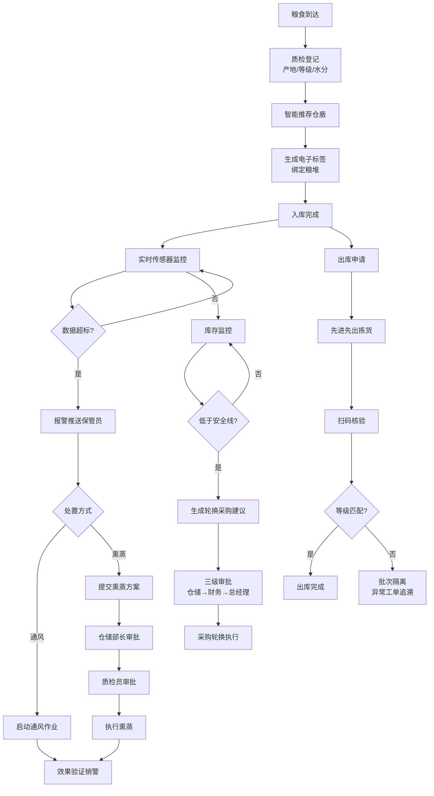

## 1. 产品概述

智慧粮食仓储管理系统，实现粮食入库、存储监控、出库、库存轮换、设备管理全流程数字化管控。通过传感器实时采集、智能分析和多级审批机制，保障储粮安全，提升仓储运营效率。

- 面向粮仓管理员、质检员、仓储部长、财务、总经理等多角色用户
- 核心价值：储粮安全可视化、作业流程标准化、管理决策智能化

## 2. 核心功能

### 2.1 用户角色

| 角色 | 说明 | 核心权限 |
|------|------|----------|
| 保管员 | 一线仓廒管理人员 | 入库登记、日常巡检、报警处置、扫码出库 |
| 质检员 | 粮食质量检测人员 | 水分/等级检测、熏蒸方案审核、不合格批次判定 |
| 仓储部长 | 仓储管理负责人 | 熏蒸方案审批、采购建议审批、工单管理 |
| 财务人员 | 财务审核人员 | 轮换采购财务审核 |
| 总经理 | 企业决策层 | 轮换采购最终审批、全局数据查看 |
| 设备主管 | 设备运维负责人 | 设备故障接单、巡检计划管理 |

### 2.2 功能模块

1. **首页大屏**：粮温热力图、虫害警报趋势、库存周转率、轮换进度、实时数据刷新
2. **入库管理**：粮食信息登记、产地/等级/水分录入、智能推荐仓廒、电子标签生成与绑定
3. **实时监控**：粮温/虫害传感器数据、超标自动报警、通风/熏蒸作业、多级审批流程
4. **出库管理**：先进先出拣货、扫码核验、不合格锁定隔离、异常工单与产地追溯
5. **库存轮换**：安全库存预警、轮换采购建议、三级审批流程
6. **设备管理**：周期巡检工单、扫码报修、超时自动升级

### 2.3 页面详情

| 页面名称 | 模块名称 | 功能描述 |
|----------|----------|----------|
| 首页大屏 | 粮温热力图 | 各仓廒实时粮温可视化展示，颜色区分温度区间，悬浮显示详情 |
| 首页大屏 | 虫害警报趋势 | 近7/30天虫害警报数量折线图，按仓廒/品种筛选 |
| 首页大屏 | 库存统计卡片 | 总库存量、各品种占比、库存周转率、低于安全线数量 |
| 首页大屏 | 轮换进度 | 各批次轮换进度条，显示采购/出库/入库状态 |
| 首页大屏 | 筛选与导出 | 按仓廒/品种/日期筛选，一键导出月度分析报告和质检明细 |
| 入库管理 | 入库登记单 | 产地、品种、等级、水分、重量信息录入表单 |
| 入库管理 | 仓廒智能推荐 | 根据品种、历史存储数据自动推荐最优仓廒列表 |
| 入库管理 | 电子标签管理 | 标签生成、二维码展示、绑定粮堆位置 |
| 入库管理 | 入库记录查询 | 历史入库记录列表，多条件筛选 |
| 实时监控 | 传感器实时数据 | 各仓廒粮温、虫害传感器实时读数，每5秒刷新 |
| 实时监控 | 报警中心 | 超标报警列表，显示级别、时间、处置状态 |
| 实时监控 | 通风作业 | 启动/停止通风，记录作业时长、效果 |
| 实时监控 | 熏蒸审批 | 熏蒸方案提交、仓储部长审批、质检员会签 |
| 出库管理 | 拣货任务 | 按先进先出自动生成拣货单，显示位置和数量 |
| 出库管理 | 扫码核验 | 扫描电子标签，核验等级与入库记录匹配 |
| 出库管理 | 异常处理 | 质检不合格自动锁定批次，生成隔离和追溯工单 |
| 库存轮换 | 安全库存预警 | 低于最低安全线的品种/数量红色高亮展示 |
| 库存轮换 | 轮换采购建议 | 系统自动生成建议，显示采购量、预估金额 |
| 库存轮换 | 多级审批流 | 仓储→财务→总经理三级审批，显示审批节点和状态 |
| 设备管理 | 巡检计划 | 输送机、烘干机周期巡检工单自动生成 |
| 设备管理 | 报修工单 | 扫码发现故障一键报修，超时未接单自动升级设备主管 |
| 设备管理 | 维修记录 | 历史维修记录、故障类型统计 |

## 3. 核心流程

### 3.1 粮食入库流程
粮车到达 → 质检员取样检测（产地/等级/水分）→ 系统智能推荐仓廒 → 保管员确认仓廒 → 生成电子标签绑定粮堆 → 入库完成

### 3.2 储粮监控与报警流程
传感器实时采集数据 → 数据超标触发报警 → 推送保管员 → 保管员启动通风/提交熏蒸方案 → 熏蒸方案经仓储部长+质检员审批 → 执行熏蒸作业 → 效果验证销警

### 3.3 粮食出库流程
出库申请 → 系统按先进先出生成拣货任务 → 保管员扫码核验 → 等级匹配放行 / 不匹配锁定隔离 → 生成异常工单追溯产地

### 3.4 轮换采购流程
库存低于安全线 → 系统生成轮换采购建议 → 仓储部长审批 → 财务审核 → 总经理审批 → 审批通过生效

## 4. 用户界面设计

### 4.1 设计风格

- **主色调**：深青色 #0D4F4F（稳重、专业），搭配麦穗金 #D4A843（粮食行业特色）
- **辅助色**：温度热力渐变（蓝→绿→黄→橙→红），报警红色 #E74C3C，安全绿色 #27AE60
- **背景**：深色主题，深灰 #1A1A2E 为主背景，卡片使用 #16213E，营造科技大屏感
- **按钮风格**：圆角胶囊按钮，悬浮有微发光效果
- **字体**：标题使用思源宋体（体现行业厚重感），数据展示使用 JetBrains Mono 等宽字体
- **布局风格**：卡片式网格布局，大屏采用三栏式仪表盘设计
- **图标风格**：线性图标，配合粮食、仓库、温度计、虫子等主题元素

### 4.2 页面设计概览

| 页面名称 | 模块名称 | UI元素 |
|----------|----------|--------|
| 首页大屏 | 整体布局 | 深色大屏背景，顶部导航+时间显示，左侧筛选面板，中部主可视化区，右侧警报面板 |
| 首页大屏 | 粮温热力图 | 仓廒平面图 + 热力色块覆盖，颜色渐变显示温度区间，点击弹窗显示传感器详情 |
| 首页大屏 | 数据卡片 | 圆角卡片 + 发光边框，大号数字 + 趋势箭头，背景微渐变 |
| 首页大屏 | 趋势图表 | 平滑曲线图，数据点微动画，渐变色填充区域 |
| 入库管理 | 表单区 | 分步骤表单，步骤指示器，输入框带图标，自动联想填充 |
| 入库管理 | 仓廒推荐 | 卡片列表显示推荐仓廒，匹配度百分比，剩余容量，历史同品种存储记录 |
| 实时监控 | 传感器面板 | 网格布局传感器卡片，实时数值跳动，状态指示灯，离线灰色显示 |
| 实时监控 | 审批流 | 时间线式审批节点，当前节点高亮，审批意见气泡框 |
| 设备管理 | 工单列表 | 状态标签颜色区分，倒计时显示超时时间，升级状态红色闪烁 |

### 4.3 响应式设计

- 桌面优先设计，最小支持 1440px 宽度
- 首页大屏针对 1920px 及以上宽度优化
- 侧边导航在平板端可折叠为图标模式
- 表格支持横向滚动

### 4.4 动画与动效

- 数据刷新时数字滚动动画
- 报警出现时红色脉冲闪烁
- 页面切换时卡片渐入+位移动画
- 热力图温度变化时颜色平滑过渡
- 审批节点完成时打勾动画
