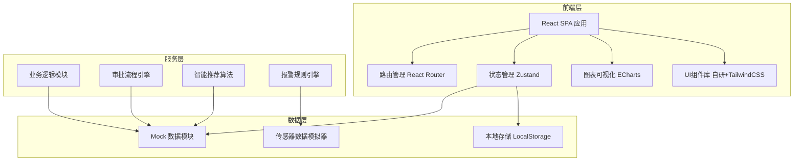
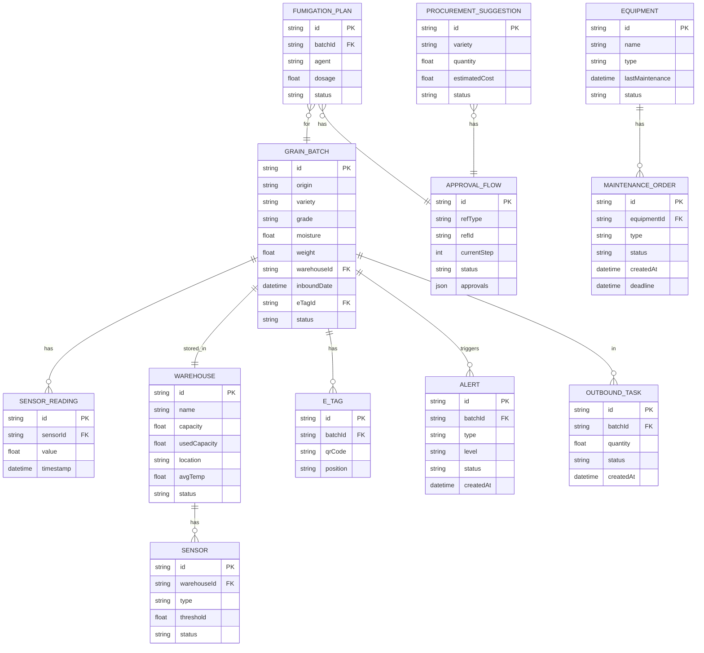

## 1. 架构设计



## 2. 技术说明

- **前端框架**：React@18 + TypeScript
- **构建工具**：Vite@5
- **样式方案**：TailwindCSS@3 + CSS变量主题系统
- **路由**：react-router-dom@6
- **状态管理**：zustand@4
- **图表可视化**：echarts@5
- **图标**：lucide-react
- **后端**：无后端，使用Mock数据模拟
- **数据存储**：浏览器 LocalStorage 持久化

## 3. 路由定义

| 路由 | 页面 | 说明 |
|------|------|------|
| / | 首页大屏 | 数据驾驶舱：粮温热力图、虫害趋势、库存统计、轮换进度 |
| /warehousing | 入库管理 | 入库登记、仓廒推荐、电子标签、入库记录 |
| /monitoring | 实时监控 | 传感器数据、报警中心、通风作业、熏蒸审批 |
| /outbound | 出库管理 | 拣货任务、扫码核验、异常处理 |
| /rotation | 库存轮换 | 安全预警、采购建议、审批流程 |
| /equipment | 设备管理 | 巡检工单、报修管理、维修记录 |

## 4. 数据模型

### 4.1 ER图



### 4.2 主要数据结构

```typescript
// 粮食品种
type GrainVariety = 'wheat' | 'corn' | 'rice' | 'soybean' | 'barley';

// 粮食等级
type GrainGrade = 'grade1' | 'grade2' | 'grade3' | 'grade4' | 'grade5';

// 报警级别
type AlertLevel = 'info' | 'warning' | 'danger' | 'critical';

// 审批状态
type ApprovalStatus = 'pending' | 'approved' | 'rejected';

interface GrainBatch {
  id: string;
  origin: string;          // 产地
  variety: GrainVariety;   // 品种
  grade: GrainGrade;       // 等级
  moisture: number;        // 水分 %
  weight: number;          // 重量 吨
  warehouseId: string;     // 仓廒ID
  inboundDate: Date;       // 入库时间
  eTagId: string;          // 电子标签ID
  temperature: number;     // 当前粮温
  pestLevel: number;       // 虫害等级
  status: 'normal' | 'warning' | 'quarantined' | 'outbound';
}

interface Warehouse {
  id: string;
  name: string;
  capacity: number;        // 总容量 吨
  usedCapacity: number;    // 已用容量 吨
  row: number;             // 仓廒行位置（热力图）
  col: number;             // 仓廒列位置（热力图）
  avgTemp: number;         // 平均温度
  sensors: Sensor[];
}

interface Sensor {
  id: string;
  warehouseId: string;
  type: 'temperature' | 'pest' | 'humidity';
  name: string;
  value: number;           // 当前读数
  threshold: number;       // 阈值
  status: 'normal' | 'offline' | 'alarm';
  lastReading: Date;
}

interface Alert {
  id: string;
  warehouseId: string;
  batchId?: string;
  type: 'temperature' | 'pest' | 'moisture' | 'equipment';
  level: AlertLevel;
  message: string;
  status: 'pending' | 'processing' | 'resolved';
  createdAt: Date;
  handler?: string;
}

interface FumigationPlan {
  id: string;
  batchId: string;
  warehouseId: string;
  agent: string;           // 药剂名称
  dosage: number;          // 用药量 g/m³
  duration: number;        // 熏蒸时长 h
  reason: string;          // 原因说明
  status: 'draft' | 'pending_approval' | 'approved' | 'executing' | 'completed' | 'rejected';
  approvals: {
    warehouseMinister?: { approved: boolean; comment?: string; time?: Date };
    qualityInspector?: { approved: boolean; comment?: string; time?: Date };
  };
  createdAt: Date;
  createdBy: string;
}

interface ProcurementSuggestion {
  id: string;
  variety: GrainVariety;
  quantity: number;        // 建议采购量 吨
  currentStock: number;    // 当前库存 吨
  minStock: number;        // 最低安全库存 吨
  estimatedPrice: number;  // 预估单价 元/吨
  estimatedCost: number;   // 预估总金额
  reason: string;
  status: 'draft' | 'warehouse_approval' | 'finance_approval' | 'gm_approval' | 'approved' | 'rejected';
  approvals: {
    warehouse?: { approved: boolean; comment?: string; time?: Date };
    finance?: { approved: boolean; comment?: string; time?: Date };
    generalManager?: { approved: boolean; comment?: string; time?: Date };
  };
  createdAt: Date;
}

interface Equipment {
  id: string;
  name: string;
  code: string;
  type: 'conveyor' | 'dryer' | 'ventilator' | 'elevator';
  location: string;
  lastMaintenance: Date;
  nextMaintenance: Date;
  status: 'normal' | 'fault' | 'maintenance';
  runHours: number;        // 运行时长 h
}

interface MaintenanceOrder {
  id: string;
  equipmentId: string;
  type: 'inspection' | 'repair';
  title: string;
  description: string;
  status: 'pending' | 'accepted' | 'processing' | 'completed' | 'escalated';
  createdAt: Date;
  deadline: Date;
  assignee?: string;
  escalated: boolean;      // 是否已升级
}

interface OutboundTask {
  id: string;
  code: string;
  items: Array<{
    batchId: string;
    quantity: number;
    grade: GrainGrade;
  }>;
  status: 'pending' | 'picking' | 'verifying' | 'completed' | 'exception';
  createdAt: Date;
  exceptionReason?: string;
}
```

## 5. 模块划分

```
src/
├── components/           # 通用组件
│   ├── layout/          # 布局组件（导航、侧边栏）
│   ├── ui/              # 基础UI组件（按钮、卡片、表格）
│   └── charts/          # 图表组件
├── pages/               # 页面组件
│   ├── Dashboard/       # 首页大屏
│   ├── Warehousing/     # 入库管理
│   ├── Monitoring/      # 实时监控
│   ├── Outbound/        # 出库管理
│   ├── Rotation/        # 库存轮换
│   └── Equipment/       # 设备管理
├── store/               # Zustand状态管理
│   ├── grainStore.ts
│   ├── warehouseStore.ts
│   ├── alertStore.ts
│   ├── approvalStore.ts
│   └── equipmentStore.ts
├── data/                # Mock数据
│   ├── grainData.ts
│   ├── warehouseData.ts
│   └── sensorData.ts
├── utils/               # 工具函数
│   ├── recommend.ts     # 仓廒推荐算法
│   ├── alertEngine.ts   # 报警规则引擎
│   └── helpers.ts
├── types/               # TypeScript类型定义
│   └── index.ts
├── hooks/               # 自定义Hooks
│   ├── useRealtimeData.ts
│   └── useApproval.ts
├── styles/              # 全局样式
│   └── index.css
├── App.tsx
├── main.tsx
└── router.tsx
```
